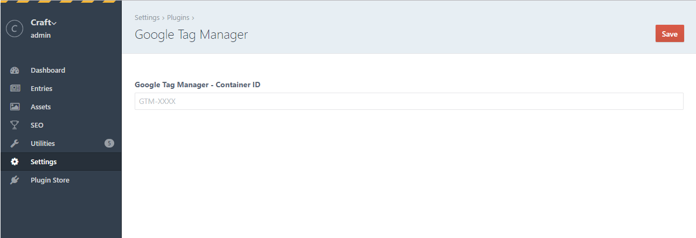

# Google Tag Manager plugin for Craft CMS 3.x

This plugin allows you to configure the "ContainerID" from the control panel 
and inject the GTM tags into the template.



## Requirements

This plugin requires Craft CMS 3.0.0-beta.23 or later.

## Installation

To install the plugin, follow these instructions.

1. Open your terminal and go to your Craft project:

        cd /path/to/project

2. Then tell Composer to load the plugin:

        composer require la-haute-societe/google-tag-manager

3. In the Control Panel, go to Settings → Plugins and click the “Install” button for Google Tag Manager.


## Configuring Google Tag Manager

You can configure the containerID from the Craft Control Panel.


## Using Google Tag Manager

Copy the code below and paste it into you layout as high as possible in the `<head>` section 
of the page:
```
{{ craft.googleTagManager.headSection() | raw }}
```

You must also paste this code immediately after the opening tag `<body>`:
```
{{ craft.googleTagManager.bodySection() | raw }}
```


Brought to you by [La Haute Société](https://www.lahautesociete.com)
